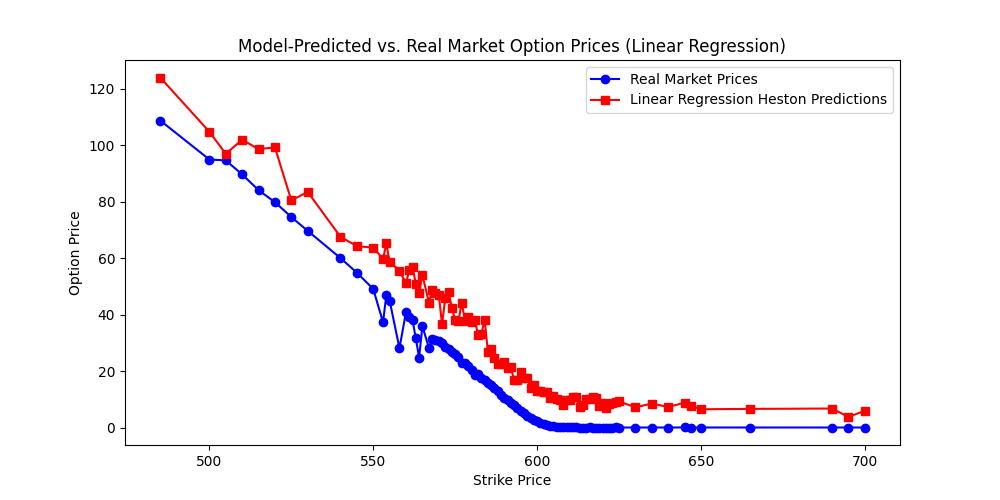

# Linear Regression Calibration of the Heston Model using Monte Carlo Simulations

## Overview

This project uses linear regression to approximate calibration of the Heston stochastic volatility model to real market data. The approach involves fitting a linear model to map option market features (strike price, implied volatility, and interest rate) to Heston model parameters. These predicted parameters are then used in a Monte Carlo simulation (via the Quadratic-Exponential scheme) to estimate option prices, which are compared to real SPY option prices.

This is a simplified, interpretable alternative to neural network-based calibration, trading model flexibility for transparency and speed.

---

## Key Features

-  **Real Market Data Integration**: Collects SPY options and implied volatility from Yahoo Finance.
-  **Linear Model for Calibration**: Fits a `LinearRegression` model to predict Heston parameters (`theta`, `kappa`, `sigma`, `rho`) from option data.
-  **Heston Simulation**: Uses Monte Carlo simulation with the Quadratic-Exponential (QE) method by Leif Andersen (2008).
-  **Performance Visualization**: Compares predicted vs real market prices for options across strike prices.

---

## File Structure

- `heston_model_linear_reg.py`: Main script for data gathering, model training, simulation, and plotting.
- `lin_reg.png`: Output plot showing predicted vs real market option prices.

---

## Dependencies

- Python 3.7+
- NumPy
- Pandas
- SciPy
- scikit-learn
- yFinance
- Matplotlib

Install them using:

```bash
pip install numpy pandas scipy scikit-learn yfinance matplotlib
```

---

## How It Works

1. **Data Collection**
   - Pulls SPY options data (near-term expiration) and risk-free rate from Yahoo Finance.
   - Constructs features: strike price, implied volatility, and risk-free rate.

2. **Synthetic Target Generation**
   - Randomly generates Heston parameter targets (`theta`, `kappa`, `sigma`, `rho`) for training.
   - Intended for demonstration—can be replaced by real calibration data.

3. **Model Training**
   - Trains a linear regression model using `scikit-learn`.

4. **Heston Simulation**
   - Predicted parameters are fed into a Monte Carlo simulator that follows the Quadratic-Exponential scheme.
   - Simulates option prices which are compared to real market data.

---

## Example Output

**Predicted vs Market Prices**  


---

## References

- Andersen, Leif B.G. (2008). *Efficient Simulation of the Heston Stochastic Volatility Model*. SSRN: [Link](https://papers.ssrn.com/sol3/papers.cfm?abstract_id=946405)

---

## Future Enhancements

- Replace synthetic Heston parameters with true calibration from market data.
- Incorporate cross-validation and performance metrics (e.g., MAE, RMSE).
- Compare linear regression performance against neural networks and traditional calibration.

---

## Author

Ioannis Hadjifrangiskou  
Quantitative Finance Enthusiast | Python + Modeling | [LinkedIn](https://www.linkedin.com/in/ioannis-hadjifrangiskou-b32302340/)

---

## License

This project is open source and available under the [MIT License](LICENSE).
